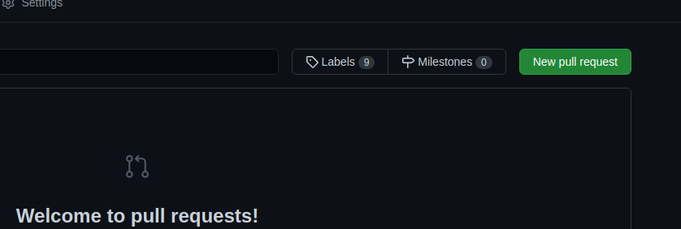

# Install Dependencies

`npm i`

# Run Local Dev Server

`npm run serve`

# Run Tests

`npm run test`

# Build for Production

`npm run build`

# Contributing
We'd love to have you contribute your cards to the Character Repository! To contribute your cards, follow the steps below:

1. Make a fork of the `aidg-characters` repo by clicking the `Fork` button in the upper-right corner of the page.


2. Add your character-embedded cards to the `characters` folder.

3. Update `characters/_manifest.json` with an entry for each added card.

Each new entry should have the following fields. The `path` field is a relative path to your image. For images in the `characters` folder, this is just the file name. The `title` field is the character's name, as it will appear on the Character Repository. The `tags` field is an array of tags for the character. These will be searchable through the app. The `relatedPrompts` is to list prompts related to the character.

```
{
	"path": "yourPic.png",
	"title": "character name",
	"description": "character description",
	"tags": ["an", "array", "of", "tags"],
	"relatedPrompts": ["https://prompts.aidg.club/1178"]
}
```

- (Optional) Test that the server builds and runs.

To test that the server builds and runs, you will need to have `node.js` and `npm` installed. Follow the instructions above to install the dependencies (`npm i`) and run the server (`npm run serve`)

4. Commit your changes so that your local fork has the new changes.

5. Create a pull request back to the original `aidg-characters` repo. This will get merged in and your characters will be live on the Character Repository!



